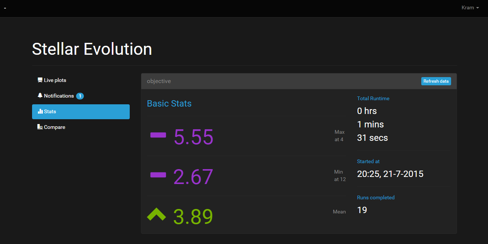

#kram

**kram** lets you keep a track on iterative optimization or any other form of time series generating routine.

It is made for keeping *logging* and *plotting* of optimization iterations out of the main program loop, because they should be.


### QuickStart

```
$ pip install git+https://github.com/lepisma/kram
```

```python
$ # import kram
$ from kram import kram
$ # initialize experiment
$ kram.init("Stellar Evolution")
$ ...
$ # Use decorator for objective function
$ @kram.kram()
$ def objective(x):
    """
    Maximize this
    """
    
    ...
    return value

$ # Perform iterations as usual
$ kram.end()
```

Program will run as usual but this time it will also open a live plotting window in your browser like this.




### Todos

**kram** is under development and many things are not here for this to be actually useful for anyone else.

- Watching multiple objective functions
- Adding notifications
- Logging and loading results
